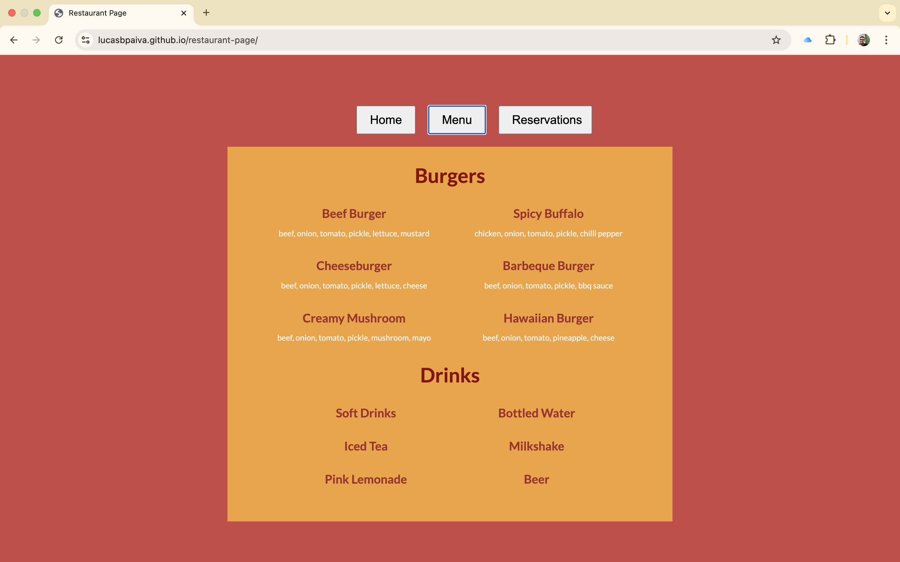

# restaurant-page

This project is a simple restaurant page I've constructed to continue practicing DOM manipulation with JavaScript and also how to use tools like npm and webpack.

The project can be seen live [here](https://lucasbpaiva.github.io/restaurant-page/).

I tried using only JavaScript to generate the contents of the website and each page was separated in its own module, which exports a function that creates a div element, adds the appropriate content and styles to that element and then appends it to the DOM. The tab-switching logic is located inside of index.js, where there are event listeners for each button in the header navbar that wipes out the current contents of div#content and then runs the correct ‘tab module’ to populate it with the new contents again. 

The main challenge though was actually getting used to the workflow of using npm and webpack to declare dependencies, bundle the JavaScript code and handling the other types of files such as html, CSS and images.